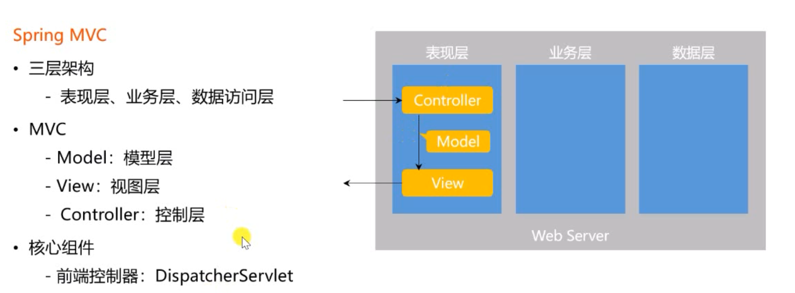
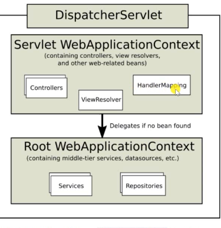
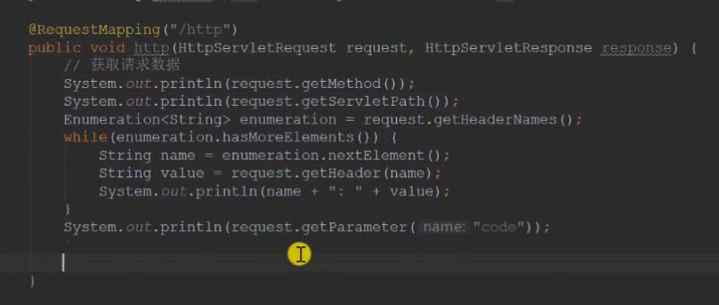

controller处理请求 调用业务组件 调用dao
他们三个之间是有依赖关系的 可以用依赖注入来实现

学习HTTP协议
HTTP协议规定浏览器和服务器通信大致分为四个步骤
1.打开一个TCP链接
2.发送一个HTTP报文
3.读取服务端返回的报文信息
4.关闭链接或者后续请求重用连接

SpringMVC入门
代码的三层架构：
    表现层 业务层 数据访问层
    
MVC三层架构
    Model：模型层
    View：视图层
    Controller：控制层

核心组件
    前端控制器 DispatcherServlet
    是整个SpringMVC的核心 
    controller model view都是DispatcherServlet调度的，在他的管理之下 基于Spring容器

 模版引擎
    Thymeleaf
    生成动态的html
    倡导自然模版，以html为模版
 

视图层的两部分代码：controller 模版templates

request获取请求数据的几种办法
