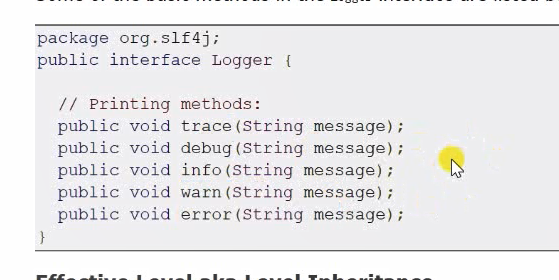
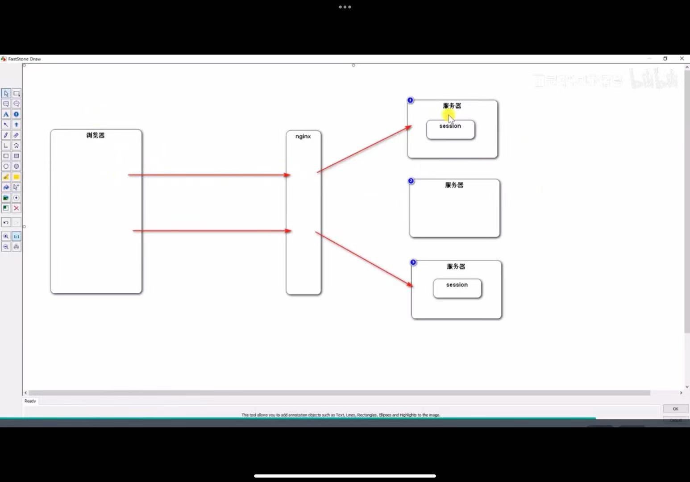

controller处理请求 调用业务组件 调用dao
他们三个之间是有依赖关系的 可以用依赖注入来实现

### 学习HTTP协议
HTTP协议规定浏览器和服务器通信大致分为四个步骤

1. 打开一个TCP链接
2. 发送一个HTTP报文
3. 读取服务端返回的报文信息
4. 关闭链接或者后续请求重用连接

### SpringMVC入门
代码的三层架构：
表现层 业务层 数据访问层

MVC三层架构
Model：模型层
View：视图层
Controller：控制层

核心组件
前端控制器 DispatcherServlet
是整个SpringMVC的核心
controller model view都是DispatcherServlet调度的，在他的管理之下 基于Spring容器

模版引擎
Thymeleaf
生成动态的html
倡导自然模版，以html为模版

视图层的两部分代码：controller 模版templates

request获取请求数据的几种办法

跳过mysql安装的部分 公司电脑可能不能用 等着回家实验

MyBatis
核心组件
【前三个核心组件被springboot整合】
SqlSessionFactory：用于创建SqlSession的工厂类
SqlSession：MyBatis的核心组件，用于向数据库执行sql
主配置文件：XML配置文件，可以对MyBatis的底层行为作出详细的配置

Mapper接口：DAO接口
Mapper映射器：用于编写sql，并将sql和实体类映射的组件，采用xml、注解实现

项目调试技巧 1.响应状态码的含义 最常见的200 302跳转重定向 404 500发生问题
2.服务端断点调试 F8逐行执行给 F7进入方法内部 F8步出 F9直接执行到下一个断点
idea可以管理断点 3.客户端断点调试 F10下一行 F11进入（这种情况比较少）
F8执行下一个断点 或执行到底 4.设置日志级别，并将日志输出到不同的终端
logback日志工具   
启用了info的话更高的级别也会启用  
产品上线之后就可以修改级别

## 登陆功能
需要用到会话管理
Cookie是服务器发送给浏览器并让浏览器保存，下次访问服务器会带着

### 分布式部署不便使用session

解决方式：

1. 粘性session：用一个session交给同一个服务器处理，问题是负载不均衡
2. 同步session：同步给其他session，也不好
3. 共享session：单独搞一台服务器存session，问题是这个服务器挂了就有影响
4. 存数据库；可以很好的共享数据，关系型数据库是存硬盘里，与内存相比比较慢，并发量大的时候有瓶颈，可以存到Redis

### 生成验证码
**kaptcha**

导入jar包、写配置类、使用api生成