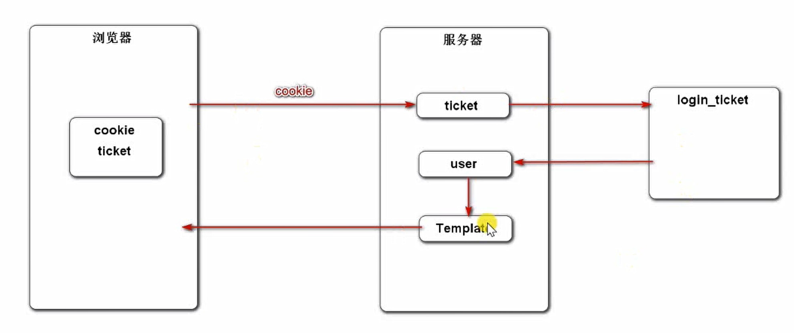
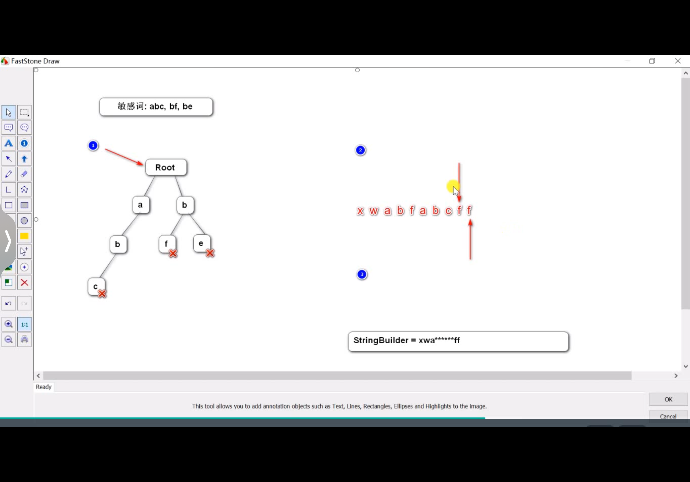
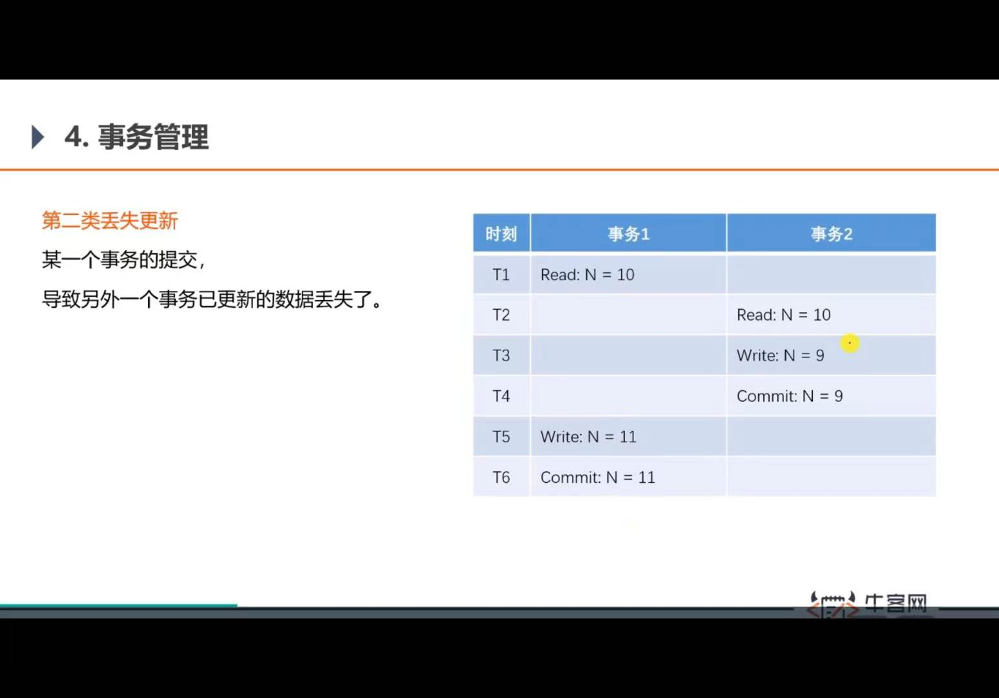
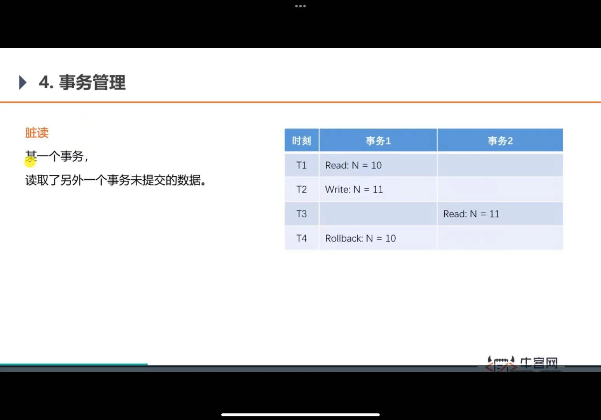
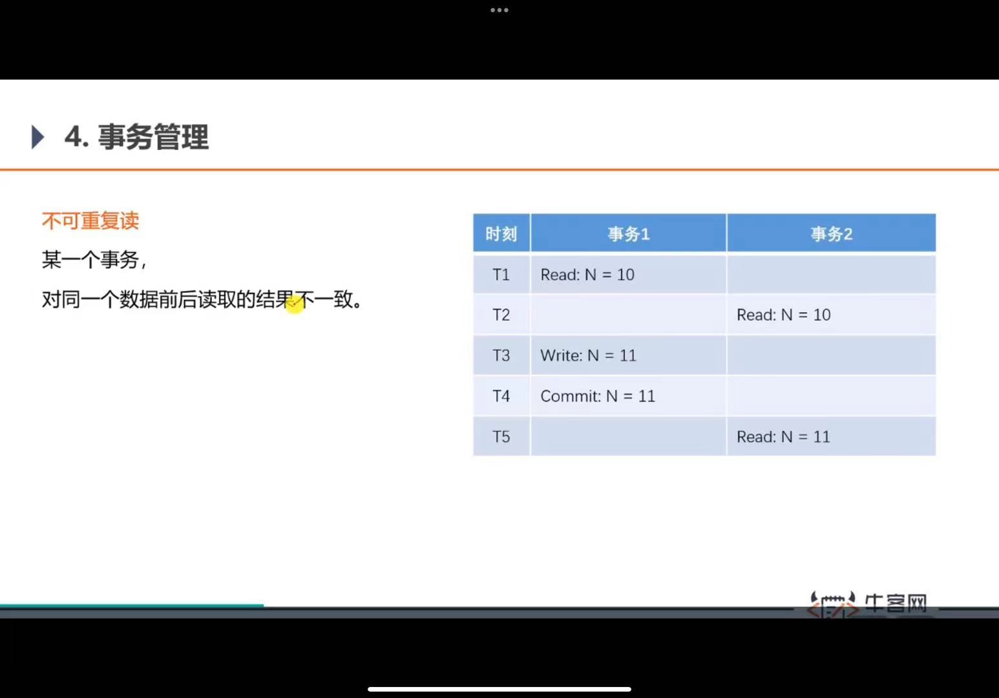
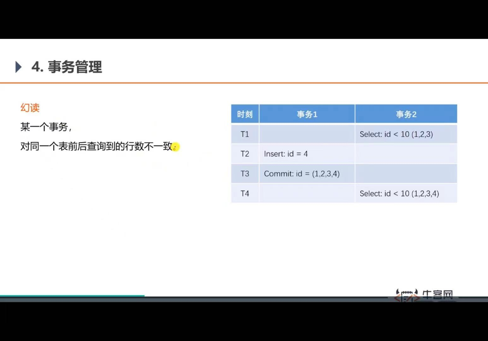
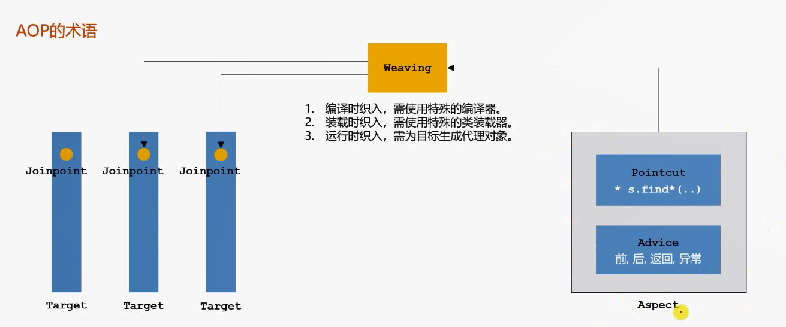

controller处理请求 调用业务组件 调用dao
他们三个之间是有依赖关系的 可以用依赖注入来实现

### 学习HTTP协议
HTTP协议规定浏览器和服务器通信大致分为四个步骤

1. 打开一个TCP链接
2. 发送一个HTTP报文
3. 读取服务端返回的报文信息
4. 关闭链接或者后续请求重用连接

### SpringMVC入门
代码的三层架构：
表现层 业务层 数据访问层

MVC三层架构
Model：模型层
View：视图层
Controller：控制层

核心组件
前端控制器 DispatcherServlet
是整个SpringMVC的核心
controller model view都是DispatcherServlet调度的，在他的管理之下 基于Spring容器

模版引擎
Thymeleaf
生成动态的html
倡导自然模版，以html为模版

视图层的两部分代码：controller 模版templates

request获取请求数据的几种办法

跳过mysql安装的部分 公司电脑可能不能用 等着回家实验

MyBatis
核心组件
【前三个核心组件被springboot整合】
SqlSessionFactory：用于创建SqlSession的工厂类
SqlSession：MyBatis的核心组件，用于向数据库执行sql
主配置文件：XML配置文件，可以对MyBatis的底层行为作出详细的配置

Mapper接口：DAO接口
Mapper映射器：用于编写sql，并将sql和实体类映射的组件，采用xml、注解实现

项目调试技巧 1.响应状态码的含义 最常见的200 302跳转重定向 404 500发生问题
2.服务端断点调试 F8逐行执行给 F7进入方法内部 F8步出 F9直接执行到下一个断点
idea可以管理断点 3.客户端断点调试 F10下一行 F11进入（这种情况比较少）
F8执行下一个断点 或执行到底 4.设置日志级别，并将日志输出到不同的终端
logback日志工具   
启用了info的话更高的级别也会启用  
产品上线之后就可以修改级别

## 登陆功能
需要用到会话管理
Cookie是服务器发送给浏览器并让浏览器保存，下次访问服务器会带着

### 分布式部署不便使用session

解决方式：

1. 粘性session：用一个session交给同一个服务器处理，问题是负载不均衡
2. 同步session：同步给其他session，也不好
3. 共享session：单独搞一台服务器存session，问题是这个服务器挂了就有影响
4. 存数据库；可以很好的共享数据，关系型数据库是存硬盘里，与内存相比比较慢，并发量大的时候有瓶颈，可以存到Redis

### 生成验证码
**kaptcha**

导入jar包、写配置类、使用api生成

mysql

\#{}表示占位符 可以防止sql注入
\${}表示拼接符 无法防止sql注入

显示用户信息的逻辑拦截器

### 自定义注解
用元注解来声明自己的注解

常用元注解

@Target 自定义的注解可以在哪个位置，可以作用在哪个类型上

@Retention 声明自定义注解保留的时间和有效的时间

@Document 自定义注解在声明文档时要不要带上

@Inherited 子类要不要继承父类

过滤敏感词

使用前缀树实现过滤敏感词的算法

前缀树的应用：字符串检索，词频统计，字符串排序

敏感词过滤器的实现步骤：

1. 定义前缀树
2. 根据敏感词，初始化前缀树
3. 编写过滤敏感词的方法

AJAX异步请求
实例：使用JQuery发送Ajax请求

### 事务管理
事务是由N步数据库操作序列组成的逻辑执行单元, 这系列操作要么全部执行,要么全部放弃

#### 事物的特性 (ACID)
1. 原子性
2. 一致性
3. 隔离性
4. 持久性

事务的隔离性
第一类丢失更新 某一个事务的回滚,导致另一个事务已更新的数据丢失了
第二类丢失更新 某一个事务的提交,导致另一个事务已更新的数据丢失了
脏读
不可重复度
幻读 对同一个表前后查询到的行数不一致 

四种隔离级别

读未提交 全部都没解决
读提交※
可重复读※
序列化

### 统一异常处理
控制器通知

### 统一记录日志
AOP面向切面编程，是面向对象OOP的补充

## Redis高性能存储方案
· Redis是一款基于键值对的NoSQL数据库,它的值支持多种数据结构:
字符串(strings)、哈希(hashes)、列表(lists)、集合(sets)、有序集合(sorted sets)等。
·Redis将所有的数据都存放在内存中,所以它的读写性能十分惊人。
同时,Redis还可以将内存中的数据以快照或日志的形式保存到硬盘上,以保证数据的安全性。
· Redis典型的应用场景包括:缓存、排行榜、计数器、社交网络、消息队列等。

Redis满足事务的机制并不严格满足acid，只有关系型数据库严格满足
Redis事务管理机制：
当我启用事务以后，会把多个redis命令放到队列里，先存着，直到提交事务会把队列发给redis服务器一起执行
所以不要在事务中间做查询，要么提前查，要么事务提交以后再差

### 阻塞队列
Blocking Queue
生产者消费者模式
避免速度不一造成系统资源的浪费

·Kafka简介
-Kafka是一个分布式的流媒体平台。
-应用:消息系统、日志收集、用户行为追踪、流式处理。
·Kafka特点
-高吞吐量、消息持久化（消息存到硬盘里）、高可靠性、高扩展性。
· Kafka术语
- Broker. Zookeeper
- Topic, Partition, Offset
- Leader Replica . Follower Replica

建立索引
发送数据